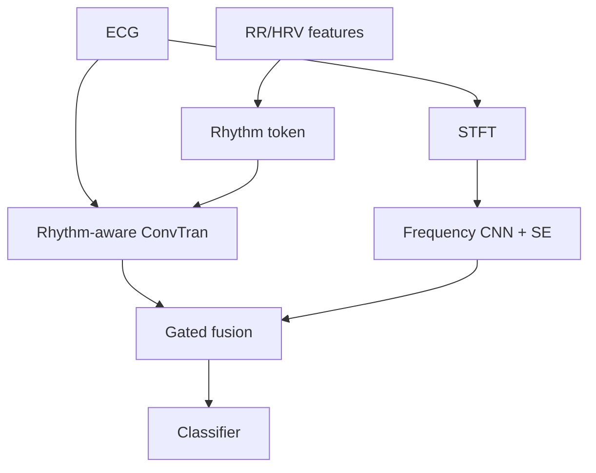

# RGTF-ConvTran

RGTF-ConvTran（Rhythm-Guided Time-Frequency ConvTran）是一个融合 ECG 时域表示、频域表示与 RR/HRV 节律信息的神经网络结构。

这个精简仓库只公开：

- RGTF-ConvTran 模型结构；
- 模型结构参数；
- R峰检测与 RR/HRV 特征构建算法；
- 模型结构和14维特征的说明文档。

仓库不包含数据集配置、固定数据形状、文件读取、数据目录组织、数据划分、训练代码、训练参数、模型权重或实验结果。

## 结构

```text
RGTF-ConvTran/
├── README.md
├── pyproject.toml
├── requirements.txt
├── .gitignore
├── docs/
│   ├── architecture.md
│   └── rr_hrv_features.md
└── src/rgtf_convtran/
    ├── __init__.py
    ├── model.py
    └── rr_hrv.py
```

## 模型组成



公开模型包含：

- 时间卷积和跨导联空间卷积；
- tAPE 绝对位置编码；
- eRPE 多头自注意力；
- RR/HRV rhythm token；
- token attention pooling；
- STFT 频域分支；
- 三层二维 CNN 和 SE 注意力；
- 时频门控融合；
- 主分类头及两个辅助分类头。

## 安装

```bash
python -m pip install -e .
```

## 模型API

```python
from rgtf_convtran import RGTFConvTran

model = RGTFConvTran(
    in_channels=channels,
    seq_len=sequence_length,
    hrv_dim=number_of_hrv_features,
)
```

输入通道数、序列长度和RR/HRV维度由使用者根据自己的数据在调用时提供。仓库没有写入任何数据集的固定值。

其余构造参数是网络结构参数，可以直接查看 `src/rgtf_convtran/model.py`。

## RR/HRV算法API

```python
from rgtf_convtran import extract_rr_hrv_features

features, metadata = extract_rr_hrv_features(
    ecg_array,
    sampling_rate_hz=sampling_rate,
    lead_mode="auto",
)
```

该函数只处理已经存在于内存中的 ECG 数组，不扫描目录、不读取数据集文件、不解析标签，也不划分数据集。

算法包括：

1. ECG信号标准化；
2. QRS频段滤波；
3. 多导联、多极性及多阈值R峰候选搜索；
4. RR间期有效范围过滤；
5. 14维RR/HRV特征计算；
6. 可选的缺失值填充与z-score转换函数。

## 未包含内容

- 数据集名称和数据集专用配置；
- 固定采样率、固定输入长度或固定导联数；
- `.npy`、CSV、NPZ等文件读取与写入；
- 数据预处理流水线和数据集划分；
- 损失函数、优化器、训练循环和训练超参数；
- 验证指标、阈值选择和checkpoint保存逻辑；
- 模型权重及实验结果。

## 许可证

当前仓库未替作者选择许可证。正式发布到GitHub前，请根据发布计划添加MIT、Apache-2.0或其他合适的开源许可证。

本代码仅供研究使用，不构成医疗诊断工具。

